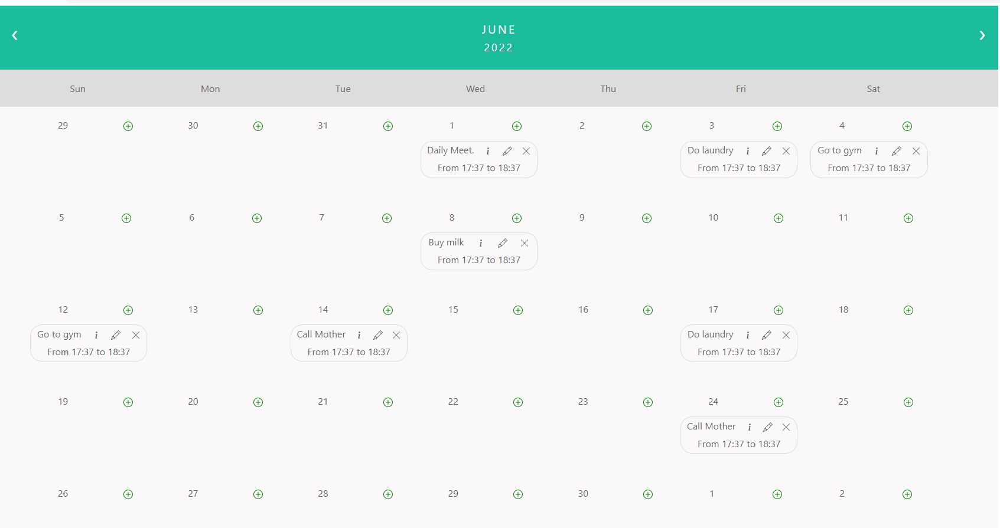

# [fd-calendario](https://www.npmjs.com/package/fd-calendario)

Angular calendar library that will make displayig events on your calendar easier than ever. We have it all, all you have to do is install the library from npm, provide the your logic for the CRUD operations and we will take care of displaying your events.

